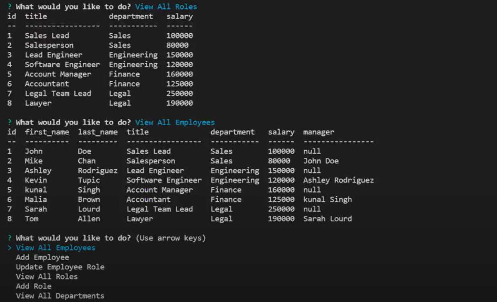

# Easy Employee Tracker
 
## Description 
This is a employee tracker command-line application for small business owner. Owners can view and manage the departments, roles, and employees in company so that owners can organize and plan their business. 
I used Node.js, Inquirer, MySQL and mysql2 to develop the application.
## Usage
Users can run the command to start it up: 
`node index.js`
## Screenshot
 

## Links

<a href="https://drive.google.com/file/d/1Dhmegx2DOkrqBtgRAfh1_pdOWDrLGC7x/view?usp=sharing">Link to the walkthrough video</a>

<a href="https://github.com/Yanbud/easy-employee-tracker">Link to the code repository</a>

## License
This project is licensed under the MIT license.
